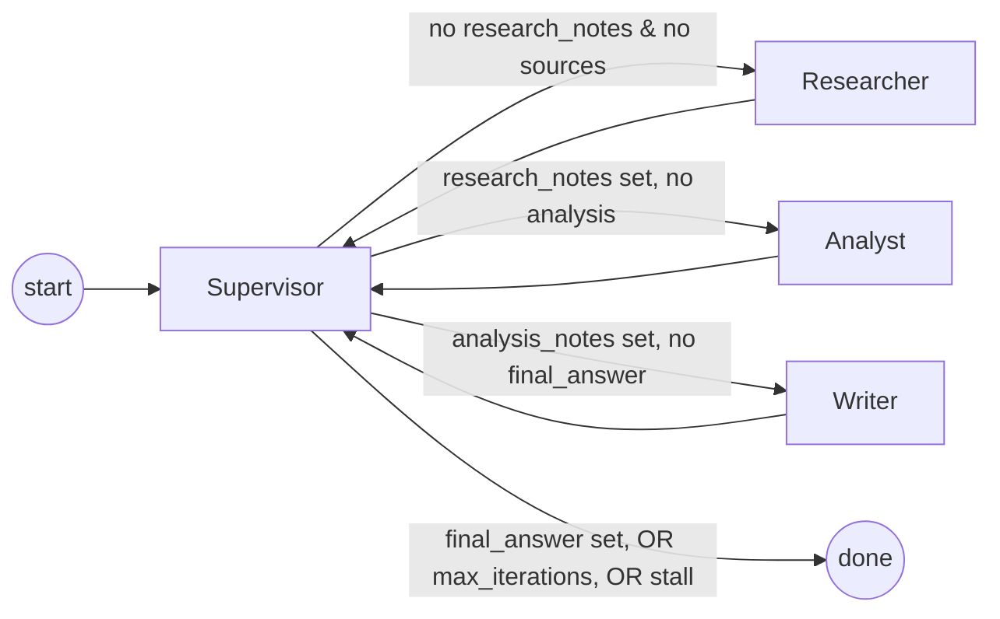

# Design Template

## Problem

Xây dựng research assistant nhận một câu hỏi nghiên cứu (research query), tự động tìm nguồn,
phân tích bằng chứng, và viết câu trả lời cuối cùng có trích dẫn — rồi so sánh cách làm
**single-agent** (1 lệnh gọi LLM, dựa hoàn toàn vào tri thức sẵn có của model) với
**multi-agent** (Supervisor điều phối Researcher → Analyst → Writer, có tra cứu nguồn thật)
trên cùng một bộ câu hỏi, đo bằng latency, cost, và citation coverage.

## Why multi-agent?

Baseline single-agent chỉ có 1 lệnh gọi LLM, không tra cứu nguồn nên **không có gì để trích
dẫn** — citation coverage đo được là 0% trên cả 3 câu hỏi benchmark. Multi-agent tách quy trình
thành 3 trách nhiệm khác nhau (tìm nguồn → phân tích claim/đối chiếu bằng chứng → viết có
citation), nên citation coverage tăng lên 28-50% tuỳ câu hỏi (trung bình 36%). Đổi lại, chi phí
thật đo được: latency trung bình tăng từ 6.77s lên 17.00s (~2.5x), cost trung bình tăng từ
$0.00027 lên $0.00080 (~3x) — vì phải gọi LLM 3 lần (Researcher, Analyst, Writer) thay vì 1 lần.

Kết luận rút ra: multi-agent chỉ đáng dùng khi **có nhu cầu trích dẫn/tra cứu nguồn thật** hoặc
câu hỏi đủ phức tạp để tách vai trò tạo giá trị (verify chéo, phát hiện evidence yếu). Với câu
hỏi đơn giản không cần trích dẫn, single-agent rẻ và nhanh hơn 2-3 lần mà chất lượng không kém.

## Agent roles

| Agent | Responsibility | Input | Output | Failure mode |
|---|---|---|---|---|
| Supervisor | Quyết định agent nào chạy tiếp theo; enforce `max_iterations`; phát hiện stall (route lặp lại không tiến triển) | Toàn bộ `state` hiện tại | `state.route_history` (route mới), `state.errors` nếu dừng bất thường | Chọn sai route nếu `_decide_route` sai logic; lặp vô hạn nếu thiếu stall guard |
| Researcher | Gọi `SearchClient` lấy nguồn liên quan, tổng hợp `research_notes` kèm `[document_id]` | `state.request.query` | `state.sources`, `state.research_notes` | `SearchClient` không có tài liệu phù hợp (fallback: trả tài liệu gần nhất thay vì rỗng); LLM bịa fact không có trong nguồn (chưa có guard tự động, chỉ giảm thiểu qua system prompt) |
| Analyst | Trích xuất claim chính từ `research_notes`, đối chiếu đồng thuận/mâu thuẫn giữa nguồn, gắn cờ evidence yếu | `state.research_notes` | `state.analysis_notes` | `AgentExecutionError` nếu `research_notes` rỗng (Researcher chưa chạy) |
| Writer | Viết câu trả lời cuối có trích dẫn `[document_id]`, đúng audience | `state.analysis_notes`, `state.request.audience` | `state.final_answer`, `state.agent_results` | `AgentExecutionError` nếu `analysis_notes` rỗng (Analyst chưa chạy) |
| Critic (bonus, **chưa implement**) | Fact-check / kiểm tra citation coverage bổ sung trước khi trả kết quả | `state.final_answer` | Ghi chú kiểm tra thêm vào `state` | — |

## Shared state

`ResearchState` (Pydantic model) — field và lý do cần:

- `request` (`ResearchQuery`): input gốc (query, audience, max_sources) — mọi agent đọc chung, không cần truyền lại qua tham số.
- `iteration`, `route_history`: Supervisor dùng để enforce `max_iterations` + phát hiện stall; đồng thời là bằng chứng trace "ai chạy khi nào, theo thứ tự nào".
- `sources` → `research_notes` → `analysis_notes` → `final_answer`: chuỗi handoff chính giữa 3 worker. Mỗi field chỉ do đúng 1 agent ghi, agent sau chỉ đọc — không mất context giữa các bước, và dễ debug (nhìn field nào rỗng là biết agent nào chưa chạy/chưa xong).
- `agent_results`: bản ghi output có metadata (token/cost) — hiện chỉ Writer ghi vào đây (là output cuối cùng cần hiển thị).
- `trace`: timeline `duration_seconds` + token/cost của **từng bước** (mọi agent ghi qua `trace_span` + `add_trace_event`) — là nguồn duy nhất mà `evaluation/benchmark.py` dùng để tính `estimated_cost_usd`, tránh đếm thiếu vì `agent_results` chỉ có Writer.
- `errors`: Supervisor ghi lý do dừng bất thường (stall, chạm `max_iterations`) — dùng làm cột "Notes" và `failure_rate` trong benchmark report.

## Routing policy

Quyết định route (`SupervisorAgent._decide_route`) là hàm thuần của `state` (không có side
effect), nên dễ unit-test độc lập:

1. Chưa có `sources`/`research_notes` → `researcher`
2. Có `research_notes`, chưa có `analysis_notes` → `analyst`
3. Có `analysis_notes`, chưa có `final_answer` → `writer`
4. Có `final_answer` → `done`

## Guardrails

- **Max iterations**: `settings.max_iterations` (mặc định 6, từ `.env` `MAX_ITERATIONS`) —
  Supervisor hard-stop, kể cả khi chưa có `final_answer`.
- **Timeout**: `settings.timeout_seconds` (mặc định 60s) truyền thẳng vào OpenAI client
  (`LLMClient.__init__`) cho từng lệnh gọi LLM.
- **Retry**: `LLMClient.complete()` retry tự động (tenacity, tối đa 3 lần, exponential backoff)
  cho lỗi kết nối/rate limit/5xx — **không** retry lỗi authentication (sai key không bao giờ tự
  hết khi thử lại). Ở cấp cao hơn, Supervisor cho phép 1 route retry (chạy lại 1 worker tối đa 2
  lần liên tiếp) trước khi fallback.
- **Fallback**: Supervisor fallback sang route `done` khi phát hiện stall (route lặp lại không
  tiến triển state) hoặc chạm `max_iterations`, luôn ghi lý do vào `state.errors`.
- **Validation**: `ResearchQuery` validate bằng Pydantic (`min_length=5` cho query); Analyst/
  Writer raise `AgentExecutionError` nếu input bắt buộc (`research_notes`/`analysis_notes`)
  chưa có, thay vì chạy với dữ liệu rỗng.

## Benchmark plan

Câu hỏi lấy từ `configs/lab_default.yaml` (`benchmark.queries`), chạy qua CLI:
`uv run python -m multi_agent_research_lab.cli benchmark`.

Kết quả thật đã chạy (`reports/benchmark_report.md`):

| Run | Avg latency | Avg cost | Avg citation coverage | Failed |
|---|---:|---:|---:|---:|
| baseline (3 runs) | 6.77s | $0.00027 | 0% | 0 |
| multi-agent (3 runs) | 17.00s | $0.00080 | 36% | 0 |

Nhận xét: multi-agent chậm hơn ~2.5x, tốn hơn ~3x, nhưng là cách duy nhất trong 2 kiến trúc này
có trích dẫn nguồn — đúng với kỳ vọng thiết kế ở mục "Why multi-agent?" phía trên. `quality_score`
(0-10) cố tình để trống trong report tự động: theo `docs/lab_guide.md`, quality được chấm qua
peer review (`docs/peer_review_rubric.md`) để tránh việc hệ thống tự chấm điểm output của chính
nó.
